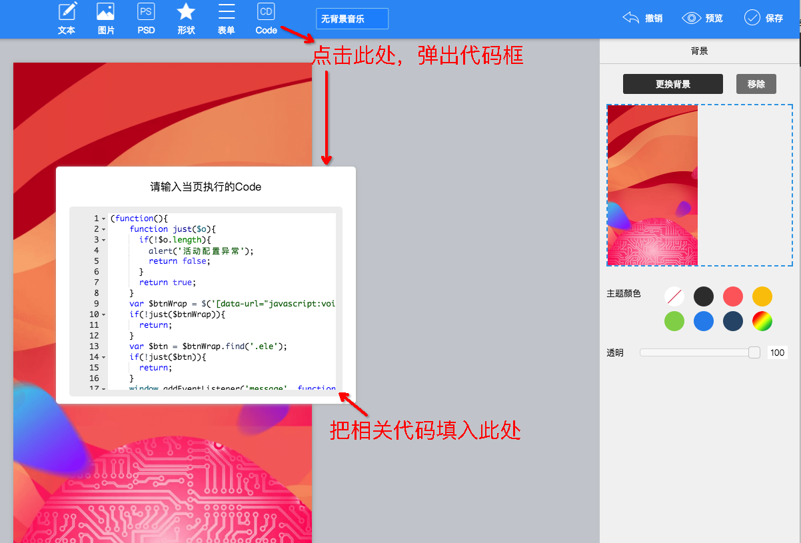
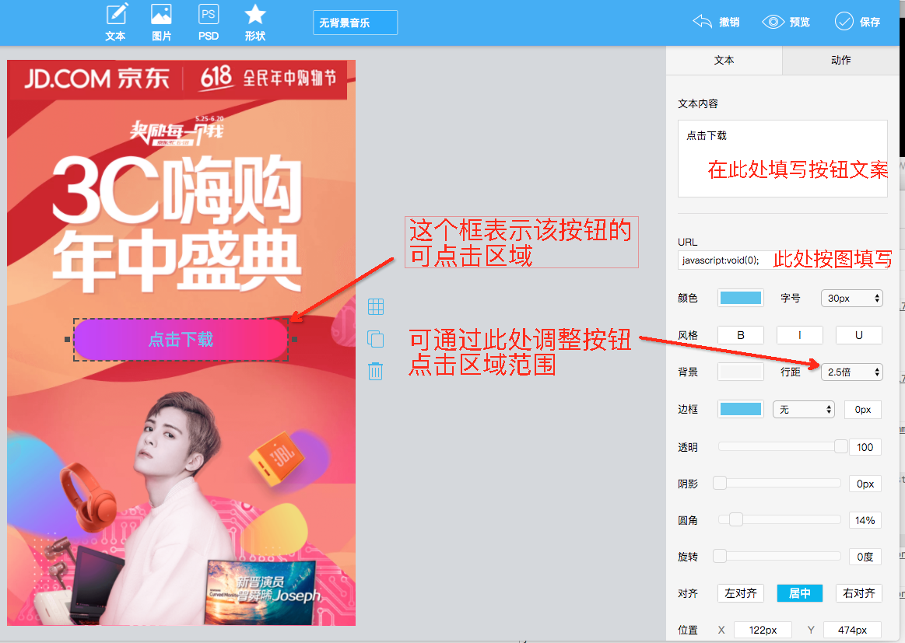
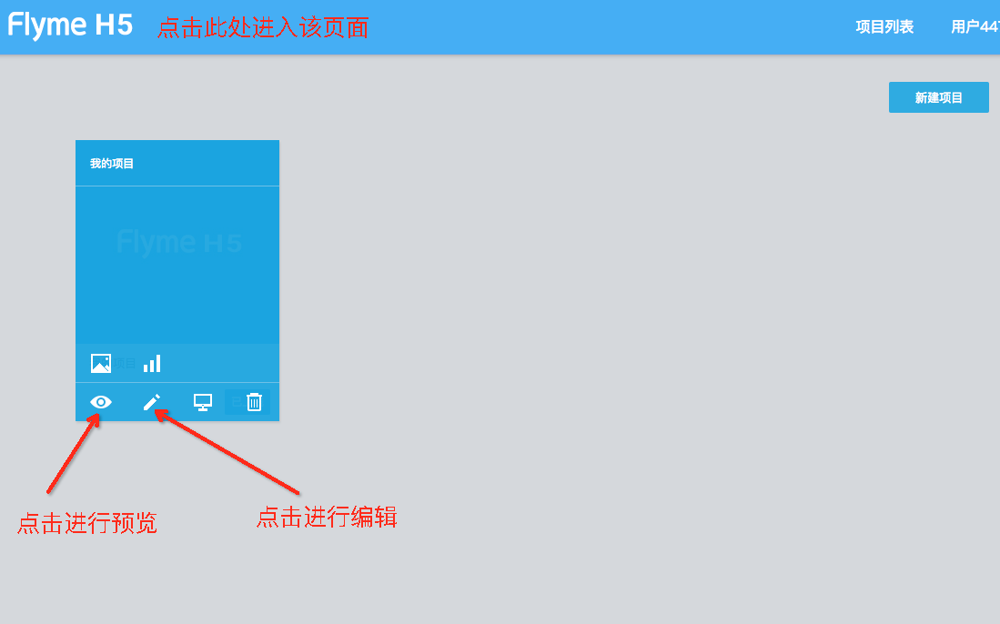
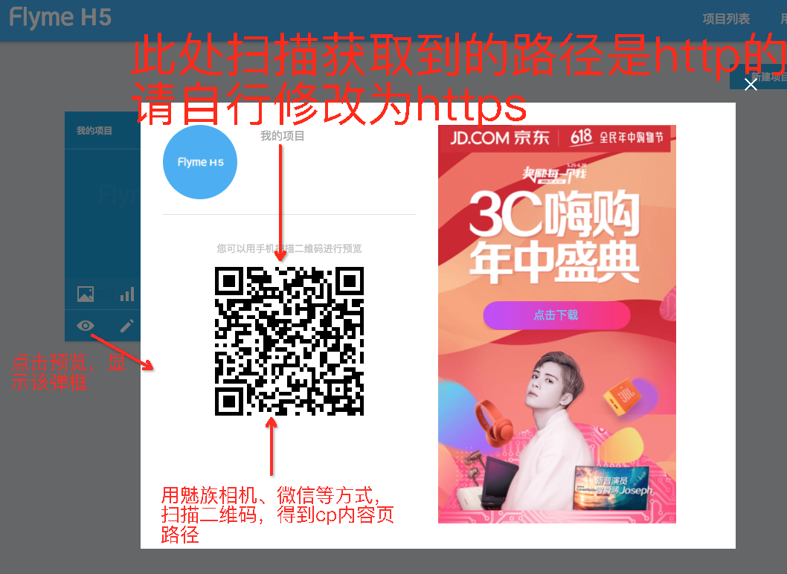

deeplink内容页配置平台使用教程
=====

平台地址
--------

http://scene.flyme.cn/


操作指南
--------

  * 此处需要填写的代码，可以从本页面下方复制

  

  

  

  

需要填写的代码
--------

  ```
  (function(){
    function just($o){
      if(!$o.length){
        alert('活动配置异常');
        return false;
      }
      return true;
    }
    var $btnWrap = $('[data-url="javascript:void(0);"]');
    if(!just($btnWrap)){
      return;
    }
    var $btn = $btnWrap.find('.ele');
    if(!just($btn)){
      return;
    }
    window.addEventListener('message', function(e){
      var data = e.data;
      if(data.event == 'mzAppDownloadProgress') {
        $btn.text(data.text);
      }
    }, false);
    $btn.click(function() {
      parent.postMessage({event: 'mzDownloadApp'},'*');
    });
  })();
  ```
