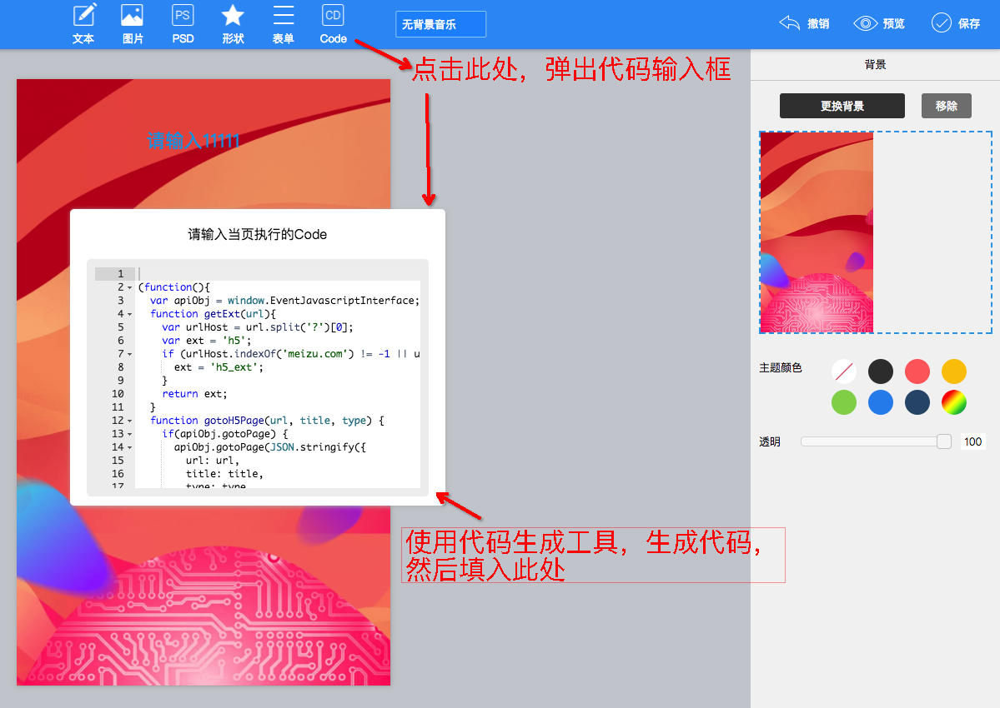

deeplink导航页配置教程
=====

跳转按钮配置
--------

`按钮顺序严格按照生成顺序排序`

```
javascript:void(0); //每个按钮的URL均填入此字符串
```


页面配置
--------

<a href='http://appff.meizu.com/front/example/deeplink-nav/output/index.html' target='_blank'>代码生成工具</a>




deeplink内容页配置平台使用教程
--------
[点击跳转](scene.md)
