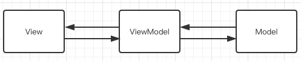
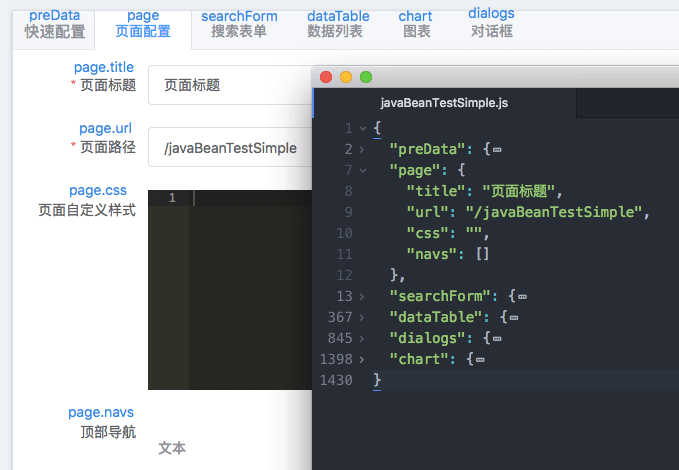
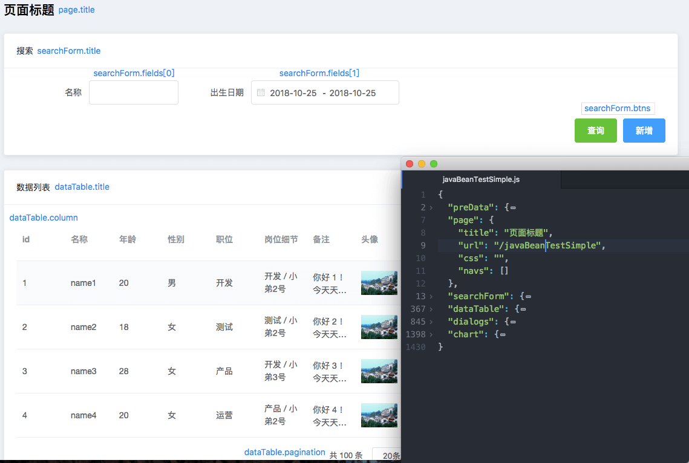
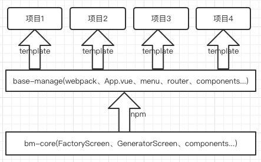
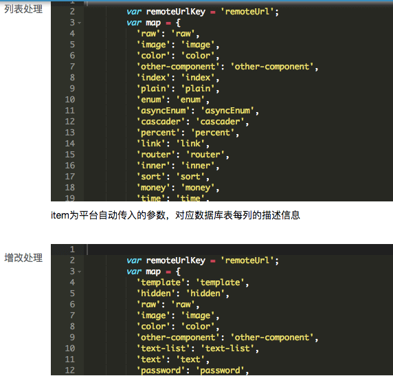
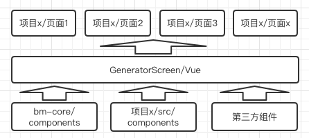
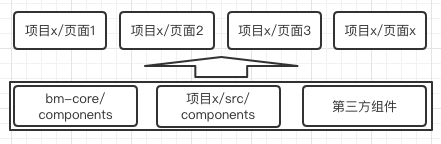

# BM平台介绍

## 意义

该平台主要的作用，是实现管理后台前端部分的高效输出、高复用和较强的可迭代性。

* 通过配置，实现管理后台常规界面（具备列表，搜索、增删改之类的常规功能）的快速输出
* 较强的可拓展性，赋予该平台较强的适用各种各样的业务场景
* 平台的组件库，具有较强的独立性，可单独适用于其他项目，对于前端来说，是重要的积累

## 原理



关于MVVM模式，大部分前端同学基本都是耳熟能详的了。而其套用到本项目，具体的应用如下

* FactoryScreen实现管理后台页面的配置
* GeneratorScreen实现管理后台页面的展示


数据驱动的模式，数据通过框架与界面形成相应的映射关系。对应上面两个模型，具体如下

* FactoryScreen模块，构建出配置界面，并把配置界面的所有输入项映射到对应的json数据项，任何一项（按钮、输入框等）值的改动，都会映射到数据上，并最终保存到相关的文件（`pages/xxx.js`）中



* GeneratorScreen模块，通过`pageCode`读取对应的数据文件（`pages/xxx.js`），构建出对应的管理后台界面



>ps:而如果足够熟悉的话，可以通过直接修改数据文件（`pages/xxx.js`），这样FactoryScreen和GeneratorScreen页面都会同时发生变化，是一种更加高效的方式

大致的原理就是这样，so easy！

## 项目架构



* `base-manage`作为模版项目，负责构建、页面的框架、路由、项目自定义组件、项目自定义页面、配置生成的数据文件等
* `bm-core`作为核心模块，包含配置模块、页面生成器、平台性组件，放置于内部仓库，以`npm`方式添加依赖

核心模块提取到内部仓库的目的，主要是

* 方便其他项目引用（其中的众多组件具有较强的复用性）
* 方便管理，可以根据项目的需要，决定加载不同版本的`bm-core`
* 方便更新和回退

## 实现

大道至简，然而实现很繁琐！

### 配置优化

上文数据文件的截图，为了方便阅读，隐藏了很多细节，只漏出大体的框架。但是，其实从行数（1430）可以看出，其实还是有挺多配置项的，那么对应到配置页面上，为了方便灵活，也是提供了非常多的选择，so，这也带了不愉悦的配置体验，繁琐！目前从下面两个方面来解决该问题。

#### 快速配置模块([查看更多细节](setting.md))

由于常规的页面，具有较强的公共特征和规律，所以，提供了`快速配置`模块，来进行快速的配置，其操作流程也很简单：

```
填入列表项配置文件路径->点击确定->点击右下角"保存配置"
```

这里提及的列表项配置文件，仅仅是列表中相关字段的简单描述（可理解为column），不同于上文提到的数据文件（`pages/xxx.js`）；下边举个例子

```
{
  "templateName": "javaBeanTestSimple", // 对应的数据文件（`pages/javaBeanTestSimple.js`）名称
  "templateTitle": "页面标题",
  "tableFields": [
    {
      "name": "id", // 列表项字段名称
      "inputType": "hidden", // 指定该字段对应到搜索、增加、修改时的输入方式（文本输入框、下拉选择框、日期选择等）
      "javaType": "long", // 指定该字段对应到列表的展示方式（直接展示字段内容、把路径转换成图片、把long型转换成日期展示等）
      "comment": "id" // 指定该字段对应到列表列的列表头名字
    },{...},{...},...
  ]
}
```

* 这里的配置文件，近乎和后端的数据库表匹配，可以直接写脚本快速生成
* 点击“确定”按钮后，平台会自动把这份简单的列表项配置转换为复杂的平台真正需要的数据配置(pages/xxx.js)

对于常规的管理页面，采用这种方式生成会极其方便，而且修改这样一份简单的配置，也是容易的多。当然，要实现这样的功能，还需要解决一些问题，例如

* 在不同的项目中，名称字段对应的文本输入框，`inputType`和`javaType`有人喜好叫"text"，有的喜好叫"plain"等。所以，快速配置模块中，提供了这两个字段对应的转换脚本，来实现后端生成字段的`inputType`和`javaType`到平台自身组件的映射



* 还有时间区间字段的配对（字段名称模糊匹配）、如何定义该字段是否可以搜索等，具体可以点击[查看更多细节](setting.md)

#### 数据配置预设置

在进行初始配置的时候，平台会自动预填一部分较常用的项（例如：列表分页功能、搜索按钮、增加按钮、`inputType`和`javaType`与平台组件的映射脚本，脑补一下这么一大段代码，每次都要手动填入的画面～）。
有三个地方可影响配置数据，其优先级（递减）大致如下

* 最终生成的每个页面自身的配置（pages/xxx.js），优先级最高
* 具体项目中的全局配置（项目x/src/config.json），影响本项目的所有页面的预填
* 平台核心模块内置的全局配置（bm-core/config.js），影响所有页面的预填，优先级最低

```
// 用伪代码表示修改页面配置时，配置项的初始化大致如下
var config = Object.assign(
                           {},
                           import(bm-core/config.js),
                           import(项目x/src/config.json),
                           import(pages/xxx.js)
                          );
load(config); // 初始化配置项
```

so，为啥要这样设计呢...举个例子，上文提及的`inputType`和`javaType`映射问题，平台的组件是固定的，但是后台生成的配置却很有可能因项目而异的，甚至因人而异，因页面而异～

* 普通的字符串文本输入框的`inputType`，平台默认的映射为:{'text':'text'}，但是某项目想改为:{'string':'text'}，那么修改"项目x/src/config.json"中的配置项后，整项目全局生效，而无需每次配置页面的时候都调整
* 做完上面的调整后，某页面又想把映射关系改为:{'varchar':'text'}，这个时候就应该修改"pages/xxx.js"或者在该页面对应的配置界面中操作，这样的调整只对本页面有效

#### 组件库

([组件](setting.md))是平台的基础，当整体框架搭建完毕后，后续的工作便剩下不断添加组件了，其结构大致如下



如上图所示，组件包括三种

* 平台核心库组件
* 项目自定义组件
* 第三方组件

页面上的所有元素都是组件，配置的过程，其实就是拼装组件的过程，而最终生成的配置数据，其实主要就描述了两个信息

* 该页面需要用到哪些组件
* 对应组件的属性配置

所以，为了支持配置更多的管理后台功能，那么就需要不断的为新的功能增加新的组件。但是不用但是组件太多，导致js和css等请求资源过大，因为平台自动实现了按需加载组件的功能（利用webpack的动态加载和vue的动态组件），只有真正需要使用到的时候，才会加载对应组件的代码文件。

```
case 'upload':
  importComponent('CfUpload') // 动态加载组件代码
  ele = ( // 使用该组件
    <cf-upload
      value={this.field.value}
      onInput={this.handleValueChange}
      disabled={this.field.disabled}
      entry={this.field}>
    </cf-upload>
  )
  break
```

自定义的组件也是按需加载的，使用的步骤也很简单，总共就两步

* 编写组件，放置到"项目x/src/compnents"目录中
* 把该组件的名称设置到页面配置项中

```
case 'other-component':
  importOtherComponent(this.field.componentName)
  ele = (<this.field.componentName
      field={this.field}
      />)
  break
```

为了更高的可拓展性，除了支持自定义组件拓展，还支持自定义页面拓展


