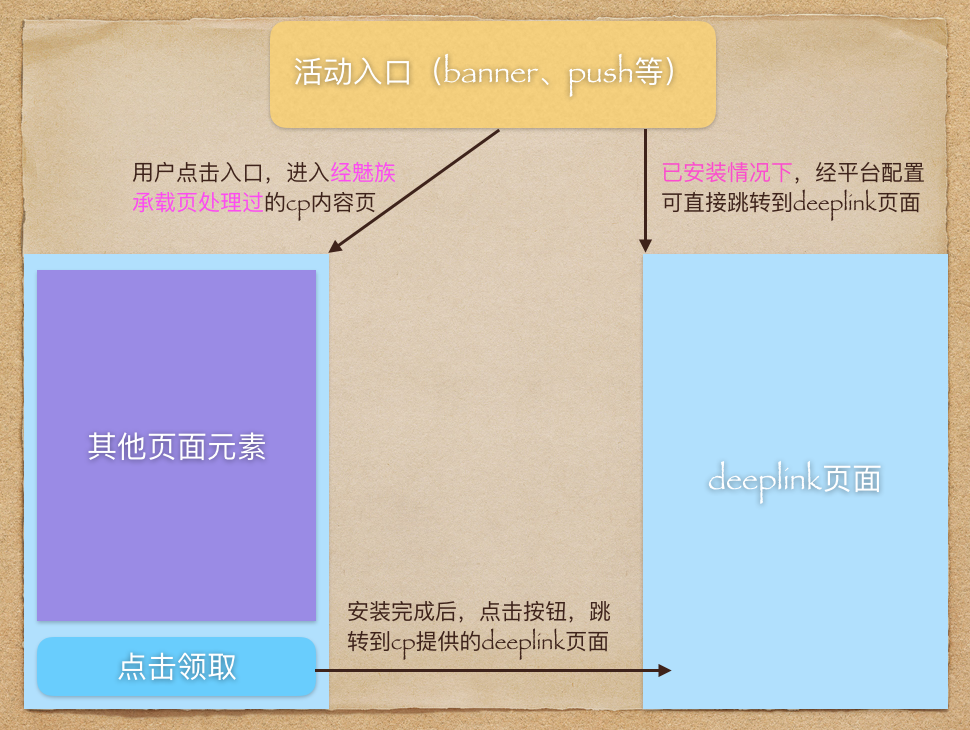
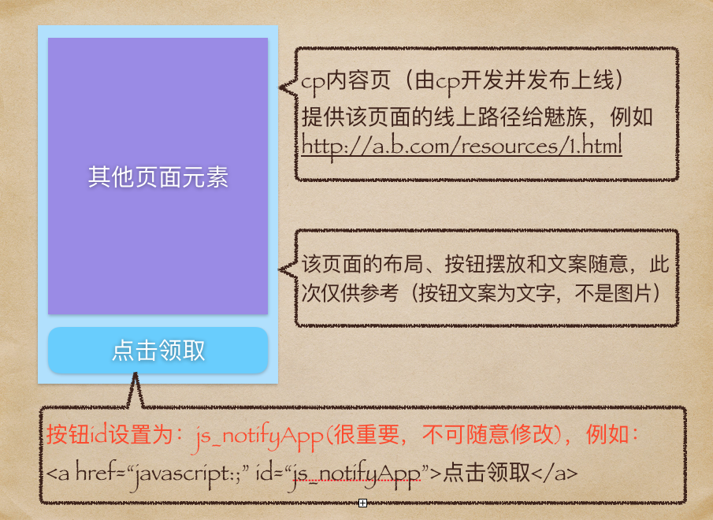
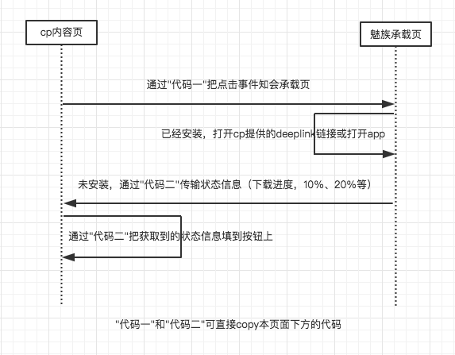

cp deeplink活动模版说明
=====

cp 只需要做
--------

* 提供应用的deeplink链接（例如：jike://page.jk/recommend?dialog=lottery）

* 开发并发布cp内容页（H5页面），然后给出线上链接（例如：https://a.b.com/resources/1.html，请提供https协议的）

* 并在cp内容页（H5页面）中添加页面下方的代码，然后把按钮id设置为“js_notifyApp”(可参考下方的“cp内容页说明”)


活动流程说明
--------

  


cp内容页说明
--------

  


流程描述
--------

* 该流程仅供熟悉和了解，可不理会（对cp透明）

  


添加到cp内容页中的代码
--------

  * cp主动调用(mzDownloadApp)，代码一：
  ```
  //App未下载，则下载应用;
  //App在下载中，在应用商店会暂停，浏览器会取消下载；
  //App已安装，则打开应用
  document.getElementById('js_notifyApp').onclick = function() {
    parent.postMessage({event: 'mzDownloadApp'},'*'); //调用下载或者打开
  };
  ```

  * cp监听(mzAppDownloadProgress)，代码二：
  ```
  // 监听mzAppDownloadProgress事件，魅族承载页面会在两种情况下发送相关数据给cp页面
  // 1.cp页面onload成功
  // 2.app下载安装中
  window.addEventListener('message', function(e){
      var data = e.data;
      if(data.event == 'mzAppDownloadProgress') {
        // data.text (安装，更新，打开 这三种对应 未安装， 更新， 安装成功状态)
        document.getElementById('js_notifyApp').innerHTML = data.text;
      }
  }, false);
  ```


  deeplink流程模拟测试工具
  --------

  [点击跳转](http://blog.shellhong.com/wiki/tools/index.html)


  deeplink链接有效性验证
  --------

  [点击跳转](http://blog.shellhong.com/wiki/tools/deeplink-test/index.html)
