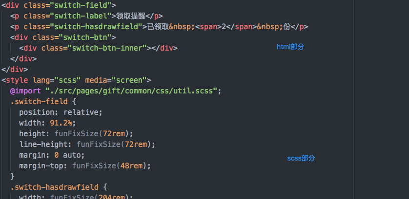

# 网页版读书项目

## 框架搭建

### 工程化

* 常规的webpack基础配置

  * eslint: 代码规范校验
  * babel: js代码转换
  * sass-loader: scss转css
  * handlebars: 模版实现
  * swig: node前端模版引擎
  * devServer: 本地服务
  * html-webpack-inlinesource-plugin: 定制开发出来的实现js、css内联的插件
  * 热加载之类的等等

>由于某些原因，没能采用vue和react的ssr

### 组件

* 内部仓库组件（例如：[banner轮播](http://blog.shellhong.com/export/views/work/carousel/index.html)）
* 原生组件

上面提及的两种组件，第一种较为常规和清晰，不再详述，此处针对第二种`原生组件`进行讲解

* 页面引用例子


如上图所示，``包裹着的组件路径，会通过`swig`注入到主页面的html中，而其中的`data-source-inline=1`标识表示该外链的`js`或`css`会通过`html-webpack-inlinesource-plugin`插件实现内联到该页面中

* `html`类型组件例子


一般情况下，一个文件夹存放一个组件的相关代码文件，引用该组件的页面，在html文件中引入组件的`index.html`（该html中包含了html、内联的`scss`和`js`），在`js`文件中引入组件的`index.js`（该js中已经引用了外联的`scss`文件`index.scss`）



需要注意的是，css相关的外联文件的类型是用文件后缀来区分，而内联的是通过`style`标签中的`lang="scss"`来表示，目前支持`scss`和`less`两种，需要明确标明所属类型`html-webpack-inlinesource-plugin`插件才能成功将其转换为`css`


* `handlebars`类型组件例子

`handlebars`类型组件只需要引用其对应的`index.js`即可

这样做的好处是外联和内联可以灵活按需使用，而且代码按组件分块，可以保证一定的解耦和代码简练。当然，如果你不是使用原生js开发，请忽略。

## 阅读器

先来思考一个基本的问题，阅读位置记录，就是每次你重新进入阅读器时，如何准确加载用户想要的章节和对应的阅读位置。简单列举几个涉及到的问题

* 路径参数与缓存数据优先级问题

假设章节id作为url参数传进来，例如第一章，这个时候自然而然的加载第一章的内容。然后当用户阅读到第十章的时候，
  * 做了一个刷新页面操作，这个时候怎么知道应该从新加载第十章，而不是第一章呢
  * 或者不是页面刷新，而是退出到详请页，点击了目录第二十章，跳进阅读器，这个时候怎么知道应该加载第二十章，而不是第十章呢

* 位置计算问题

当前阅读记录需要及时记录，而且记录的是当前章节相对于屏幕的坐标（原因可以琢磨琢磨）

* 初始化加载一章还是两章

如果整屏显示的是同一章节的内容，那么下次进来，只需要初始化加载这一章节的内容。如果同时显示了两个章节（某一章节的尾部和下一章节的头部），那么下次初始化加载和逻辑又有所不同了

* 字体变化问题

阅读器一般都能设置字体的大小，那么随着字体的变化，当前正在阅读的章节以及相关段落位置便会发生较大变化（字体变大，每个章节的占位便会变大，前面的章节就会把当前章节往下挤，而字体变小则反之）

so，如何解决上面提及的问题呢，先来看一下初始化的流程图


从流程图来看，应该大部分问题的不言而喻了，至于字体的变化问题处理，可以通过读取变化前后的文章区域高度变化比例，然后乘以当前位置来获取

## 多行省略号实现

* webkit特定css
```
display: -webkit-box;
-webkit-box-orient: vertical;
-webkit-line-clamp: 3;
overflow: hidden;
```

* 文字截取

根据屏幕的宽度，截取一定字符串个数的文字

* 容器测试

```
getHtmlEllipse (originStr, suffix, divEl) {
  var html = `${originStr}${suffix}`
  divEl.innerHTML = html
  if (divEl.offsetHeight > MAX_HEIGHT) {
    return this.getHtmlEllipse(originStr.substring(0, originStr.length - 1), suffix, divEl)
  }
  return `${originStr}${suffix}`
}
```

* 容器右下角遮挡

  * 在容器右下角放一个`div`，内容设置为‘...’，并设置渐变
  * 通过`float`可以实现文字超出出现遮挡，不超出则不会出现
