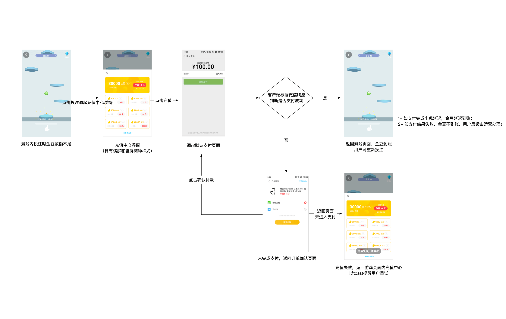

# 游戏前端对接文档

## 关键参数获取

关键参数会拼接到游戏页面路径中，例如：`https://cp.com/game1.html?userPin=123456&token=eyJ1c2VySWQiOjEyMzQ1NiwicGFydG5lciI6IndhbmZlbmciLCJyYW5kb20iOiJlYzNiMmI4OC1jNzAxLTRhOTktODViYy1hYzIyNDdiNDY2OWYifQ==`

## jssdk引入

* 页面中引入：`<script src="https://dido-h5-cdn.sanctpalace.com/static/sdk/gamecpsdk.js" charset="utf-8"></script>`

## 回退
```
if (window.ZXUtil) {
  ZXUtil.default.back()
}
```

## 充值

```
// 供参考监听代码
var beginRecharge = false
window.addEventListener('visibilitychange', () => {
    if (document.visibilityState === 'visible' && beginRecharge) {
        // 调用后台接口，更新金豆
        beginRecharge = false // 变量重置
    }
})

function recharge (gameId) { // 充值调用
    beginRecharge = true
    if (window.ZXUtil) {
      ZXUtil.default.toRecharge(gameId) // 
    }
}
```

## getUserUniqueSign

```
if (window.ZXUtil) {
  ZXUtil = ZXUtil.default
  ZXUtil.getUserUniqueSign('wanfeng').then(function (result) {
    if (result.status === 1) { // 成功
      console.log('result--', result) // 结果中的字符串与拼在路径上的search一样
    } else { // 失败
      console.log('getUserUniqueSign,message--', ZXUtil.getMessage(result))
    }
  })
}
```

## 交互流程


