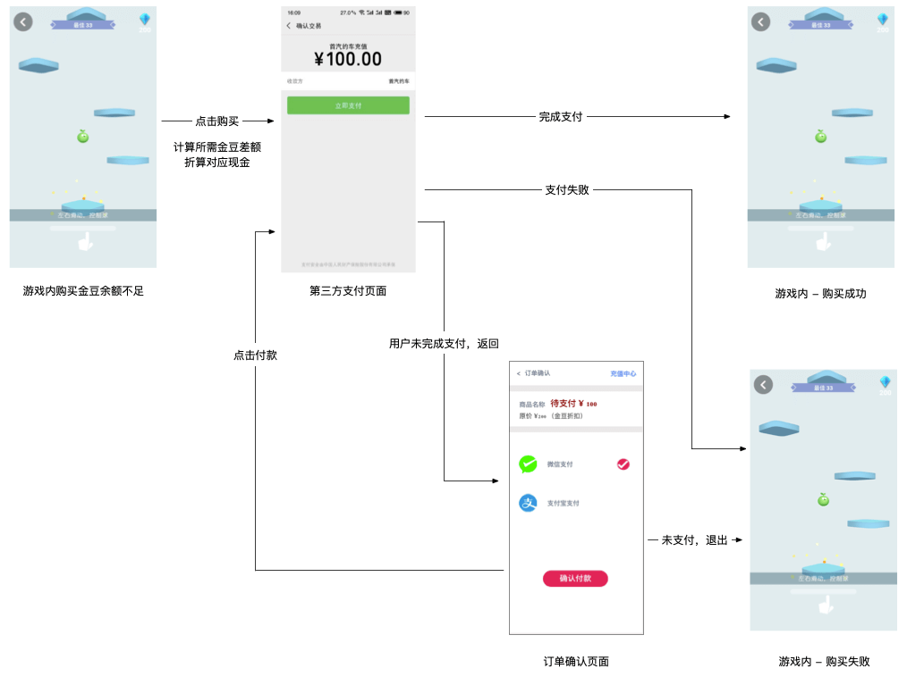

# 游戏前端对接文档

## 关键参数获取

关键参数会拼接到游戏页面路径中，例如：`https://cp.com/game1.html?userId=123456&code=eyJ1c2VySWQiOjEyMzQ1NiwicGFydG5lciI6InlpbGV3YW4iLCJyYW5kb20iOiI4NzQ2OWU0YS1hNWM0LTRjYWQtYWU2MS1hZTE1NDgxNDE2MzAifQ==`

## jssdk引入

* 页面中引入：`<script src="https://dido-h5-cdn.sanctpalace.com/static/sdk/gamecpsdk.js" charset="utf-8"></script>`

## 付费接口调用

```
if (window.ZXUtil) {
  ZXUtil = ZXUtil.default

  // 初始化购买逻辑，仅需要进入页面的时候调用一次即可
  ZXUtil.initBuy({
    lockFn: function () { // 开始进行支付流程，进行界面锁定（loading等提示展示）
      console.log('lockFn')
    },
    removeLockFn: function () { // 支付流程结束，界面解锁
      console.log('removeLockFn')
    }
  }).then(function (result) {
     // 上次付钱成功后，由于未知原因（断网、app crash之类的）中断了后续的后台请求操作，从新进入页面后继续之前的操作
     // result为结果，{code: -1, message: "用户金豆不足."}，code为-1表示失败，1表示成功，0表示啥都没做，失败的时候才会有message字段
    if (result.code === 1) {
      console.log('initBuy success')
    } else if (result.code === -1) {
      console.log('initBuy,message--', result.message)
    }
  })


  var params = {
    partner: 'yilewan', // 写死即可
    outTradeNo: 'abc3', // 购买方订单ID
    goldBean: '1000', // 实付价格，金豆
    originPrice: '10000', // 原价
    subject: 'subject', // 商品名
    body: 'body', // 商品描述
    notifyUrl: 'notifyUrl', // 充值成功回调地址
    extContent: 'extContent', // 购买方自定义扩展字段，回调时原样返回
    sign: 'md5', // 签名
    signType: 'sadfasdfasf', // 签名方式(md5)
    chargeOptionId: 0, // 写死即可
    img: '' // 商品图片，可为空字符串
  }

  // 付费接口调用，每次购买时调用
  ZXUtil.buy(params).then(function (result) {
    // result为结果，{code: -1, message: "用户金豆不足."}，code为-1表示失败，1表示成功，0表示啥都没做，失败的时候才会有message字段
    if (result.code === 1) {
      console.log('buy success')
    } else if (result.code === -1) {
      console.log('buy,message--', result.message)
    }
  })
}
```
## 回退
```
if (window.ZXUtil) {
  ZXUtil.default.back()
}
```

## 用户信息查询

```
if (window.ZXUtil) {
  ZXUtil = ZXUtil.default
  ZXUtil.getUserInfo().then(function (result) {
    if (result.status === 1) { // 成功
      console.log('getUserInfo,res--', result.res)
    } else { // 失败
      console.log('getUserInfo,message--', ZXUtil.getMessage(result))
    }
  })
}

// 成功情况下，数据如下：
{
  createTime: 1555588116000,
  icon: "http://image.res.meizu.com/image/uc/80f8d55d49464e3e90d72f6679cbf970z?t=946656000000",
  id: 1000,
  lmodify: 1555588116000,
  nickname: "用户650417044",
  phone: "",
  phoneRegion: "+80",
  readHobby: null,
  sex: 0,
  status: 1
}
```

## 用户金豆查询

```
if (window.ZXUtil) {
  ZXUtil = ZXUtil.default
  ZXUtil.getBalaceInfo().then(function (result) {
    if (result.status === 1) { // 成功
      console.log('getBalaceInfo,res--', result.res)
    } else { // 失败
      console.log('getBalaceInfo,message--', ZXUtil.getMessage(result))
    }
  })
}

// 成功情况下，数据如下：
{
  activityInfo: "冲100送50京豆",
  balance: 0,
  userId: 1000
}
```

## getUserUniqueSign

```
if (window.ZXUtil) {
  ZXUtil = ZXUtil.default
  ZXUtil.getUserUniqueSign('yilewan').then(function (result) {
    if (result.status === 1) { // 成功
      console.log('result.res.query--', result.res.query) // 此处打印结果与拼在路径上的参数一样
    } else { // 失败
      console.log('getUserUniqueSign,message--', ZXUtil.getMessage(result))
    }
  })
}
```

## 信息提示

```
ZXUtil.default.toast('toast message!')
```

## 交互流程


